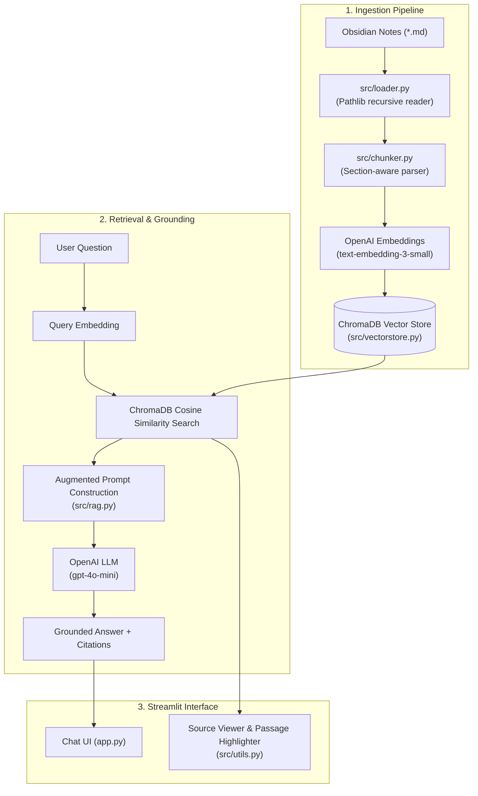

# 🧠 Obsidian Vault RAG Knowledge Assistant

A lightweight, student-level **Retrieval-Augmented Generation (RAG)** MVP that turns your personal [Obsidian](https://obsidian.md/) Markdown knowledge vault into an interactive, verifiable AI assistant.

Built with **pure Python**, **Streamlit**, **OpenAI API**, and **ChromaDB** — without complex orchestrator frameworks like LangChain or LlamaIndex — making every component clean, explainable, and production-minded.

---

## 📑 Table of Contents
- [Key Features](#-key-features)
- [How It Works](#-how-it-works)
- [System Architecture](#-system-architecture)
- [Tech Stack](#-tech-stack)
- [Project Structure](#-project-structure)
- [Quick Start Guide](#-quick-start-guide)
- [Environment Variables](#-environment-variables)
- [Demo Experience](#-demo-experience)
- [Example Questions & Evaluation](#-example-questions--evaluation)
- [Interview & Concept Guide](#-interview--concept-guide)
- [Limitations & Future Roadmap](#-limitations--future-roadmap)

---

## ✨ Key Features

1. **Native Obsidian Vault Ingestion**:
   - Recursively reads Markdown (`.md`) files using Python's standard `pathlib`.
   - Preserves headings (`#`, `##`, `###`), document titles, and wikilinks (`[[Note]]`).
2. **Section-Aware Document Chunking**:
   - Splits notes along structural markdown headers and paragraph boundaries.
   - Preserves exact character offsets and section names to enable precise source citations.
3. **ChromaDB & OpenAI Embeddings**:
   - Embeds text chunks into dense 1536-dimensional vectors using OpenAI `text-embedding-3-small`.
   - Stores and performs fast cosine similarity queries via an embedded ChromaDB collection.
4. **Strictly Grounded Generation**:
   - LLM generation (using `gpt-4o-mini`) is strictly constrained to the retrieved vault context.
   - If information is missing from the vault, the assistant safely returns:  
     > *"I couldn't find enough information about this in your Obsidian knowledge base."*
5. **Interactive Source Viewer with Exact Passage Highlighting (Core Feature)**:
   - Every generated answer cites its specific source notes.
   - Clicking any cited source opens the original note in an interactive viewer with the **exact retrieved passage highlighted in-place**.
6. **Preloaded Demo Vault + Custom Vault Upload**:
   - Test immediately with the preloaded 5-note AI knowledge vault (`data/demo_vault/`).
   - Or upload your own zipped Obsidian vault (`.zip`) or `.md` files.

---

## 🛠️ How It Works

```
1. Ingestion:
   Obsidian Notes (.md) ──► pathlib Loader ──► Section Chunker ──► OpenAI Embeddings ──► ChromaDB Vector Store

2. Query & Grounding:
   User Question ──► Query Embedding ──► Top-K Vector Search ──► Context Prompt ──► LLM (gpt-4o-mini) ──► Grounded Answer + Source Metadata

3. Verification:
   Click Source Note ──► In-App Document Viewer ──► Exact Passage Highlighted in Full Markdown
```

---

## 📐 System Architecture



---

## 🧰 Tech Stack

Strictly minimal and free of unnecessary bloatware:

| Component | Technology | Purpose |
|---|---|---|
| **Language** | Python 3.10+ | Clean, readable implementation |
| **User Interface** | Streamlit | Fast, intuitive web application |
| **Vector Store** | ChromaDB | Lightweight, embedded vector database |
| **Embedding Model** | OpenAI `text-embedding-3-small` | 1536-dimensional semantic representation |
| **LLM Generation** | OpenAI `gpt-4o-mini` | Deterministic, grounded response synthesis |
| **File Traversal** | Python `pathlib` | Native file system handling for `.md` notes |
| **Configuration** | `python-dotenv` | Secure API key management |

---

## 📁 Project Structure

```
obsidian-rag-assistant/
├── app.py                      # Main Streamlit web application & chat state
├── requirements.txt            # Minimal Python dependencies
├── README.md                   # Project documentation & interview guide
├── .gitignore                  # Git ignore rules (.env, .venv, etc.)
├── .env.example                # Template for environment configuration
│
├── data/
│   └── demo_vault/             # Preloaded Obsidian vault with 5 comprehensive notes
│       ├── RAG.md              # RAG concepts, ingestion, retrieval, advantages
│       ├── LLMs.md             # Model architectures, pretraining, SFT, RLHF
│       ├── Embeddings.md       # Vector semantics, cosine similarity, distance metrics
│       ├── Vector_Databases.md # ChromaDB, HNSW indexing, vector searches
│       └── AI_Agents.md        # ReAct pattern, planning, memory, and tools
│
└── src/
    ├── __init__.py             # Python package marker
    ├── loader.py               # Markdown file discovery & title extraction
    ├── chunker.py              # Header/section-aware chunking with character offsets
    ├── vectorstore.py          # ChromaDB collection & OpenAI embedding client
    ├── rag.py                  # Grounded prompt construction & LLM inference
    └── utils.py                # Source highlighting engine & ZIP vault extractor
```

---

## 🚀 Quick Start Guide

### 1. Clone & Set Up the Environment

```bash
# Clone repository
git clone https://github.com/miniag006/obsidian-rag-assistant.git
cd obsidian-rag-assistant

# Create virtual environment
python3 -m venv .venv
source .venv/bin/activate

# Install dependencies
pip install -r requirements.txt
```

### 2. Configure API Key

Create a `.env` file in the root directory:

```bash
cp .env.example .env
```

Add your OpenAI API Key inside `.env`:
```env
OPENAI_API_KEY=sk-your-actual-api-key-here
```
*(Alternatively, you can enter the API key directly in the Streamlit sidebar input field).*

### 3. Launch the Application

```bash
streamlit run app.py
```

Open your browser to `http://localhost:8501`.

---

## 💡 Demo Experience

1. **Open the App**: Notice the clean, intuitive interface.
2. **Click "Load Demo Vault"**: Instantly parses all 5 notes, breaks them into 40 section chunks, and generates vector embeddings.
3. **Ask a Question**: E.g., *"What is RAG and why is it useful?"*
4. **Inspect the Answer**: The LLM synthesizes a concise, factually grounded answer.
5. **Click a Source Note**: Under the answer, click `📄 RAG.md`.
6. **Verify Highlighted Passage**: The full note opens in the viewer with the exact passage used to answer your question highlighted in yellow.
7. **Test Out-of-Vault Fallback**: Ask *"What is the recipe for baking chocolate cookies?"*. Notice the assistant avoids hallucination and clearly indicates the knowledge is missing.

---

## 🎯 Example Questions & Evaluation

| Type | Example Question | Expected Source | Expected Behavior |
|---|---|---|---|
| **RAG Fundamentals** | *"Why is RAG better than asking a raw LLM?"* | `RAG.md` | Explains hallucination reduction, access to private data, and citations. |
| **Vector DBs** | *"How does ChromaDB index vectors for fast search?"* | `Vector_Databases.md` | References HNSW indexing and approximate nearest neighbors. |
| **Embeddings** | *"What is the formula for cosine similarity?"* | `Embeddings.md` | Explains dot product divided by magnitude product. |
| **AI Agents** | *"How does the ReAct framework work?"* | `AI_Agents.md` | Explains Thought $\rightarrow$ Action $\rightarrow$ Observation cycle. |
| **Out-of-Domain** | *"Who won the 2022 World Cup?"* | None | Safe fallback: *"I couldn't find enough information about this in your Obsidian knowledge base."* |

---

## 🎓 Interview & Concept Guide

If you need to explain this project during an interview, here are the key concepts:

### 1. Why Markdown (`.md`)?
Obsidian vaults are organized as local Markdown files. Markdown contains natural semantic boundaries: titles (`#`), sections (`##`), bullet points, and `[[wikilinks]]`. This allows our loader and chunker to preserve structural document context rather than arbitrarily cutting sentences.

### 2. How does Section-Aware Chunking work?
Instead of blindly splitting text every 500 characters, `src/chunker.py` parses markdown header tags (`#`, `##`, `###`). Each chunk carries:
- `heading`: The active section title (e.g. *"Why RAG is Essential"*).
- `start_char` & `end_char`: Exact string offsets in the raw note.
- `chunk_id`: Unique identifier formatted as `filename#chunk_index`.

### 3. Why are Embeddings needed?
Traditional keyword search (e.g., BM25 or grep) fails when a user uses synonyms (e.g. asking *"plumbing fix"* when the document says *"repair leaky pipe"*). Dense vector embeddings map text to high-dimensional space where semantic distance corresponds to conceptual similarity.

### 4. How does ChromaDB work here?
ChromaDB runs in-memory or persisted locally. It builds an **HNSW (Hierarchical Navigable Small World)** graph index over the vectors, enabling sub-millisecond approximate nearest neighbor searches using Cosine Distance:
$$\text{Distance} = 1 - \text{Cosine Similarity}$$

### 5. How does Grounding and Hallucination Prevention work?
We set `temperature = 0.0` and use a strict system prompt instructing the model to synthesize answers exclusively from provided context blocks. If the top retrieved chunks have low similarity scores ($< 0.25$) or do not contain the answer, the pipeline triggers an explicit fallback message rather than guessing.

### 6. How does Exact Passage Highlighting work?
Because `src/chunker.py` stores the exact raw text and character offsets of each chunk, `src/utils.py` locates the exact substring in the full original note and wraps it inside an HTML `<mark>` element without modifying the original file on disk.

---

## ⚠️ Limitations & Future Roadmap

- **Graph Traversal**: Currently retrieves chunks via vector similarity; future versions can traverse Obsidian `[[wikilinks]]` for multi-hop graph RAG.
- **Reranking**: Adding a cross-encoder reranker (e.g., Cohere / BGE reranker) could further improve retrieval precision on very large vaults (>1,000 notes).
- **Hybrid Search**: Combining BM25 keyword search with dense vector search for hybrid lexical + semantic retrieval.
