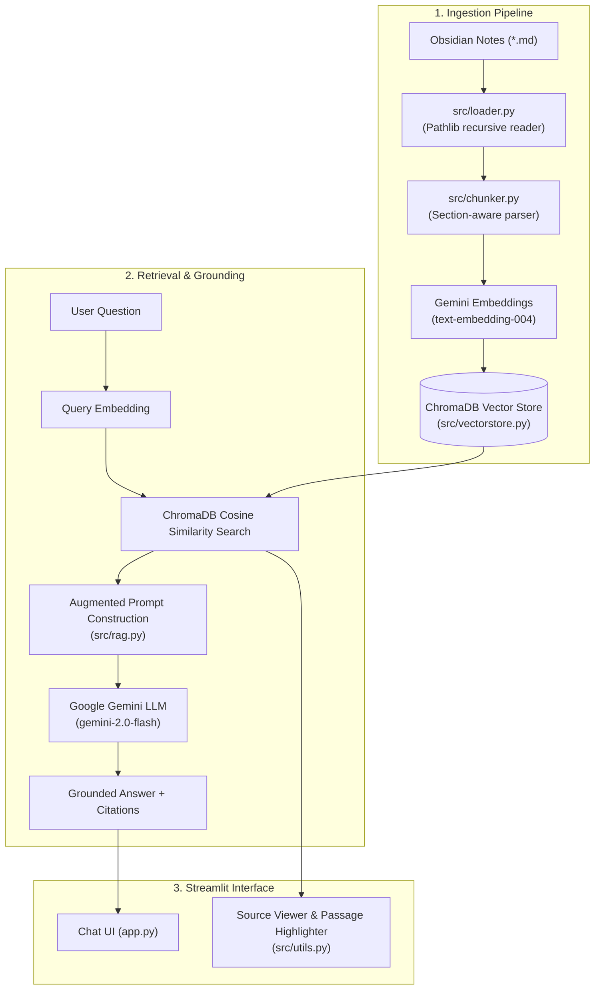

# 🧠 Obsidian Vault RAG Knowledge Assistant

A lightweight, student-level **Retrieval-Augmented Generation (RAG)** MVP that turns your personal [Obsidian](https://obsidian.md/) Markdown knowledge vault into an interactive, verifiable AI assistant.

Powered by **Google Gemini API** (Free Tier via Google AI Studio) and **ChromaDB** — built with pure Python and Streamlit without heavy framework bloat (no LangChain, LlamaIndex), making every single component clean, explainable, and production-minded.

---

## Live Demo

https://obsidian-rag-assistant.streamlit.app/

---

## 📑 Table of Contents
- [Key Features](#-key-features)
- [How It Works](#-how-it-works)
- [System Architecture](#-system-architecture)
- [Tech Stack](#-tech-stack)
- [Project Structure](#-project-structure)
- [Quick Start Guide](#-quick-start-guide)
- [Environment Variables](#-environment-variables)
- [Demo Experience](#-demo-experience)
- [Example Questions & Evaluation](#-example-questions--evaluation)
- [Interview & Concept Guide](#-interview--concept-guide)
- [Limitations & Future Roadmap](#-limitations--future-roadmap)

---

## ✨ Key Features

1. **Native Obsidian Vault Ingestion**:
   - Recursively reads Markdown (`.md`) files using Python's standard `pathlib`.
   - Preserves headings (`#`, `##`, `###`), document titles, and wikilinks (`[[Note]]`).
2. **Section-Aware Document Chunking**:
   - Splits notes along structural markdown headers and paragraph boundaries.
   - Preserves exact character offsets and section names to enable precise source citations.
3. **ChromaDB & Google Gemini Embeddings**:
   - Embeds text chunks into dense vectors using Gemini's `text-embedding-004` (Free tier).
   - Stores and performs fast cosine similarity queries via an embedded ChromaDB collection.
4. **Strictly Grounded Generation**:
   - LLM generation (using `gemini-2.0-flash`) is strictly constrained to the retrieved vault context.
   - If information is missing from the vault, the assistant safely returns:  
     > *"I couldn't find enough information about this in your Obsidian knowledge base."*
5. **Interactive Source Viewer with Exact Passage Highlighting (Core Feature)**:
   - Every generated answer cites its specific source notes.
   - Clicking any cited source opens the original note in an interactive viewer with the **exact retrieved passage highlighted in-place**.
6. **Preloaded Demo Vault + Custom Vault Upload**:
   - Test immediately with the preloaded 5-note AI knowledge vault (`data/demo_vault/`).
   - Or upload your own zipped Obsidian vault (`.zip`) or `.md` files.

---

## 🛠️ How It Works

```
1. Ingestion:
   Obsidian Notes (.md) ──► pathlib Loader ──► Section Chunker ──► Gemini Embeddings (text-embedding-004) ──► ChromaDB Vector Store

2. Query & Grounding:
   User Question ──► Query Embedding ──► Top-K Vector Search ──► Context Prompt ──► LLM (gemini-2.0-flash) ──► Grounded Answer + Source Metadata

3. Verification:
   Click Source Note ──► In-App Document Viewer ──► Exact Passage Highlighted in Full Markdown
```

---

## 📐 System Architecture



---

## 🧰 Tech Stack

Strictly minimal and free of unnecessary bloatware:

| Component | Technology | Purpose |
|---|---|---|
| **Language** | Python 3.10+ | Clean, readable implementation |
| **User Interface** | Streamlit | Fast, intuitive web application |
| **Vector Store** | ChromaDB | Lightweight, embedded vector database |
| **Embedding Model** | Google Gemini `text-embedding-004` (Free) | 768-dimensional semantic representation |
| **LLM Generation** | Google Gemini `gemini-2.0-flash` (Free) | Fast, deterministic grounded synthesis |
| **File Traversal** | Python `pathlib` | Native file system handling for `.md` notes |
| **Configuration** | `python-dotenv` | Secure API key management |

---

## 📁 Project Structure

```
obsidian-rag-assistant/
├── app.py                      # Main Streamlit web application & chat state
├── requirements.txt            # Minimal Python dependencies
├── README.md                   # Project documentation & interview guide
├── .gitignore                  # Git ignore rules (.env, .venv, etc.)
├── .env.example                # Template for environment configuration
│
├── data/
│   └── demo_vault/             # Preloaded Obsidian vault with 5 comprehensive notes
│       ├── RAG.md              # RAG concepts, ingestion, retrieval, advantages
│       ├── LLMs.md             # Model architectures, pretraining, SFT, RLHF
│       ├── Embeddings.md       # Vector semantics, cosine similarity, distance metrics
│       ├── Vector_Databases.md # ChromaDB, HNSW indexing, vector searches
│       └── AI_Agents.md        # ReAct pattern, planning, memory, and tools
│
└── src/
    ├── __init__.py             # Python package marker
    ├── loader.py               # Markdown file discovery & title extraction
    ├── chunker.py              # Header/section-aware chunking with character offsets
    ├── vectorstore.py          # ChromaDB collection & Gemini embedding client
    ├── rag.py                  # Grounded prompt construction & LLM inference
    └── utils.py                # Source highlighting engine & ZIP vault extractor
```

---

## 🚀 Quick Start Guide

### 1. Clone & Set Up the Environment

```bash
# Clone repository
git clone https://github.com/miniag006/obsidian-rag-assistant.git
cd obsidian-rag-assistant

# Create virtual environment
python3 -m venv .venv
source .venv/bin/activate

# Install dependencies
pip install -r requirements.txt
```

### 2. Configure Free API Key

Get a free Gemini API key from [Google AI Studio](https://aistudio.google.com/) (no credit card required).

Create a `.env` file in the root directory:

```bash
cp .env.example .env
```

Add your Gemini API Key inside `.env`:
```env
GEMINI_API_KEY=AIzaSy...your_gemini_key
```

*(Alternatively, you can paste the key directly in the Streamlit sidebar field).*

### 3. Launch the Application

```bash
streamlit run app.py
```

Open your browser to `http://localhost:8501`.

---

## 💡 Demo Experience

1. **Open the App**: Notice the clean, intuitive interface.
2. **Click "Load Demo Vault"**: Instantly parses all 5 notes, breaks them into 40 section chunks, and generates vector embeddings.
3. **Ask a Question**: E.g., *"What is RAG and why is it useful?"*
4. **Inspect the Answer**: Gemini synthesizes a concise, factually grounded answer.
5. **Click a Source Note**: Under the answer, click `📄 RAG.md`.
6. **Verify Highlighted Passage**: The full note opens in the viewer with the exact passage used to answer your question highlighted in yellow.
7. **Test Out-of-Vault Fallback**: Ask *"What is the recipe for baking chocolate cookies?"*. Notice the assistant avoids hallucination and clearly indicates the knowledge is missing.

---

